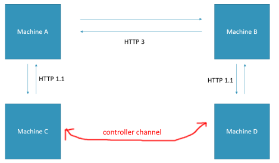

Tools for Cyber Project 2021 from Ariel University.  
The project is not done as of this writing.
In this repository I public tools I build that sarve the project and can  be  helpful  to  another  person  in  the  worlds.
More tools  that  designed  only  for  the  project  have  in  the  private  repository.

# About the Cyber Project 2021

In  the  recent  years, many  person  developer  methods  to  indicate  whether  traffic  in  the  network  is  malicious,  to  attribute  it  to  known  malware  “families”  and  to  discover  new  threats.  The  hypothesis  of  Cyber  Project  2021  is  to  test  a possible way  to  bypass  this method  and  run  malware  without  to  be  revealed.  Newer  internet  protocols (HTTP, DOH)  design  to  give  the  user  more  privacy  and  performance.  But  maybe  the  new  internet  protocols  impair  this.
The project instructors are Dr. Amit Dvir, Dr. Ran Dubin, Dr Chen Hajaji and Adiel Amshalom.
The project presenters are Alon Perlmuter, Yishay Garame, Zohar Zrihen, Adi Lichy, David Chitiz, Aviv Vexler(me)  as of this writing. for more information contact me.
# About my pert
My  project  is to take  old  traffic  with  malware  that  communication  in  HTTP1.1  and  upgrade  to  HTTP3.  To  do  it, I  developer  special  proxy  that  work  above  the  HTTP  as  opposed  to  normal  proxy  that  work  above  TCP.  This  proxy  allows  me  to  take  traffic  in  HTTP1.1  from  the client,  upgrade  to  HTTP3  record  the  traffic,  downgrading  back  to  HTTP1.1  and  serve  the  server.
# Logic of experiment

The  experiment  runs  on  four  machines  like  the  figure.  Machine  C  is  simple  client,  Machine  A  take  HTTP1.1  traffic  convert  to  HTTP3  and  send  to  Machine  B.  Machine  B  take  HTTP  3  traffic  convert  to  HTTP1.1  and  send  to  Machine  D.  Machine  D  is  simple  server.  In  the  instruction  of  the  following  tools  I  use  the  Machine  A, B, C  and  D.
# The tools
All tools test on ubuntu 20.04 that run in virtualbox 6.0.24
- http1ToHttp3 - Proxy  that  run  in  two  machines A  and  B. in  machine  A  the  proxy  convert  HTTP1.1 traffic  from  the client  and  send  to  machine  B  in  HTTP3. in  machine  B  the  proxy  convert  HTTP3 to  HTTP1.1 and  send  to  client.
- http1Replay - Replay http1 queries between two machines.
- serverSimulation - very simple server for web that run on HTTP1.1 to test if all tools and experiment work.
